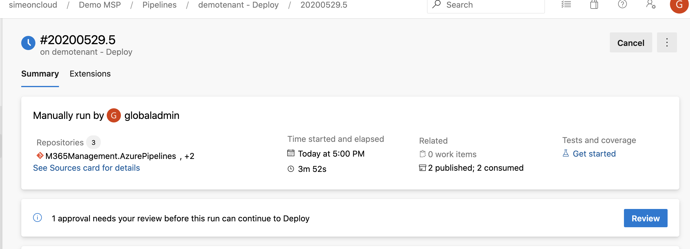

# Approvals

## How to Require Approval

* Navigate to [Azure DevOps](http://dev.azure.com) and click on your project \(named after your company\)
* On the left-hand side, click on **Pipelines** &gt; **Environments**
  * To require approval before deploying changes, click **Deploy**
  * To require approval before committing exported changes, click **Export**
* In the upper-right corner, click **...** &gt; **Approvals and checks** &gt; **+** &gt; **Next**
* Under **Approvers**, add the group or user that you want to require approval from
  * To add a user as an approver, type and then click the user's email address
  * To add an approval that allows any member of your organization to approve the operation, type and then click **Project Valid Users**
  * Under **Advanced**, ****you can choose whether to allow approvers to approve their own runs by selecting the box. This will be enabled by default
  * Under **Control options**, you can specify the amount of time before the deploy or export times out if not approved - this will be set to 30 days by default
* Click **Create**

## **How to Approve**

* Navigate to **Pipelines** &gt; **\[tenant name\]** **-** **Deploy** &gt; **\#\[date\].\[run number\]** \(e.g. \#20200528.1\) ****
* Click the **Extensions** tab and review the changes to be approved - for Deploy operations this will be under the **Preview** section and for Export operations this will be under the **Export** section
* Navigate to the summary tab and click **Review** &gt; **Approve**

## How to Remove Approval

* Approvals can easily be removed by navigating to the environment you want to remove an approval from \(Deploy or Export\)
* Once you have selected either the **Deploy** or **Export** environment, click **...** &gt; **Approvals and checks** &gt; hover mouse over the approval you want to delete &gt; **trash icon** &gt; **Delete**

